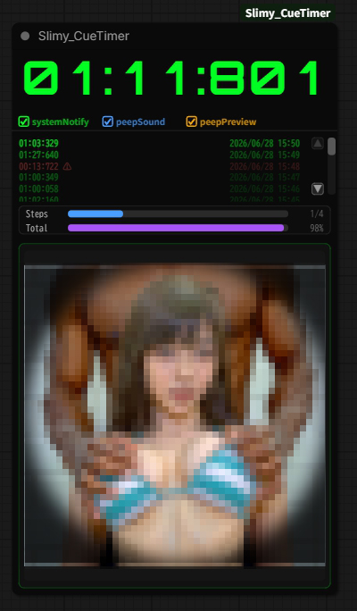

# Slimy_CueTimer

ComfyUI用のキュー進捗モニターができるアクセサリです。
レンダリング中の進行状況、処理速度、履歴、プレビューを1つのノードで確認できます。

------------------------------------------------------------------------

## 主な機能
    **キュー実行されると自動的にタイムカウントがスタートし完了までの時間を計測します**
    **キュー完了時にシステム通知と音で通知します**
    **Kサンプラーが出力するプレビュー画像を表示します**
-   **PeepPreviewは、KSamplerがサブグラフ内にある場合でもリアルタイム表示できます。**
-   **ノード接続が不要なため、ワークフロー内の見やすい位置へ自由に配置できます。**

------------------------------------------------------------------------

### プログレス表示

-   Steps進捗バー
-   Total進捗バー
-   処理速度（it/s）
-   完了率（%）
-   経過時間
-   残り時間

> **※
> Total進捗は、直近のレンダリング履歴から予測した進捗・残り時間を表示します。**

### 履歴

-   最新5件を表示
-   ▲▼ボタンで1件ずつスクロール
-   処理終了後も履歴を保持

### PeepPreview

レンダリング画像をリアルタイム表示します。

表示／非表示を切り替え可能です。

※プレビューを非表示にしても、プログレスバー・履歴は表示されたままです。

### 通知

-   SystemNotify：処理終了時にシステム通知を表示
-   PeepSound：処理終了時に通知音を再生
-   AutoQueue：キュー終了後、自動で次のキューを開始

------------------------------------------------------------------------

## 用途

-   長時間レンダリングの監視
-   バッチ処理の進行確認
-   生成画像のリアルタイム確認
-   レンダリング時間の予測

------------------------------------------------------------------------

## 動作環境

-   ComfyUI
-   Slimy Custom Nodes

------------------------------------------------------------------------

## 更新履歴

### v1.0

-   Steps / Total の2種類の進捗バー
-   履歴5件表示
-   履歴スクロールボタン
-   PeepPreview
-   プレビュー表示／非表示
-   SystemNotify
-   PeepSound
-   AutoQueue
-   経過時間・残り時間・処理速度表示
