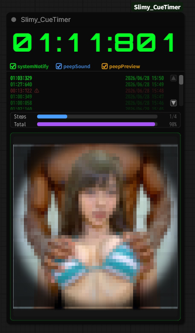

# Slimy_CueTimer

A progress monitor node for ComfyUI.

Monitor rendering progress, processing speed, render history, and live previews from a single node.

------------------------------------------------------------------------

## Features

- **PeepPreview displays live previews even when the KSampler is running inside a subgraph.**
- **No node connections are required, so the node can be placed anywhere in your workflow.**

------------------------------------------------------------------------

## Main Functions

### Progress Display

- Steps progress bar
- Total progress bar
- Processing speed (it/s)
- Completion percentage (%)
- Elapsed time
- Estimated remaining time

> **Note:** The Total progress bar estimates overall progress and remaining time based on recent rendering history.

### History

- Displays the latest five render jobs
- Scroll through history using the ▲▼ buttons
- History is retained after rendering completes

### PeepPreview

Displays the current render in real time.

The preview can be shown or hidden at any time.

Even when the preview is hidden, the progress bars and history remain visible.

### Notifications

- **SystemNotify** – Displays a system notification when rendering finishes.
- **PeepSound** – Plays a notification sound when rendering finishes.
- **AutoQueue** – Automatically starts the next queued job after the current one completes.

------------------------------------------------------------------------

## Typical Uses

- Monitoring long rendering jobs
- Tracking batch processing progress
- Watching generated images in real time
- Estimating render completion time

------------------------------------------------------------------------

## Requirements

- ComfyUI
- Slimy Custom Nodes

------------------------------------------------------------------------

## Changelog

### v1.0

- Steps and Total progress bars
- Five-entry render history
- History scroll buttons
- PeepPreview
- Preview show/hide toggle
- SystemNotify
- PeepSound
- AutoQueue
- Elapsed time, remaining time, and processing speed display
